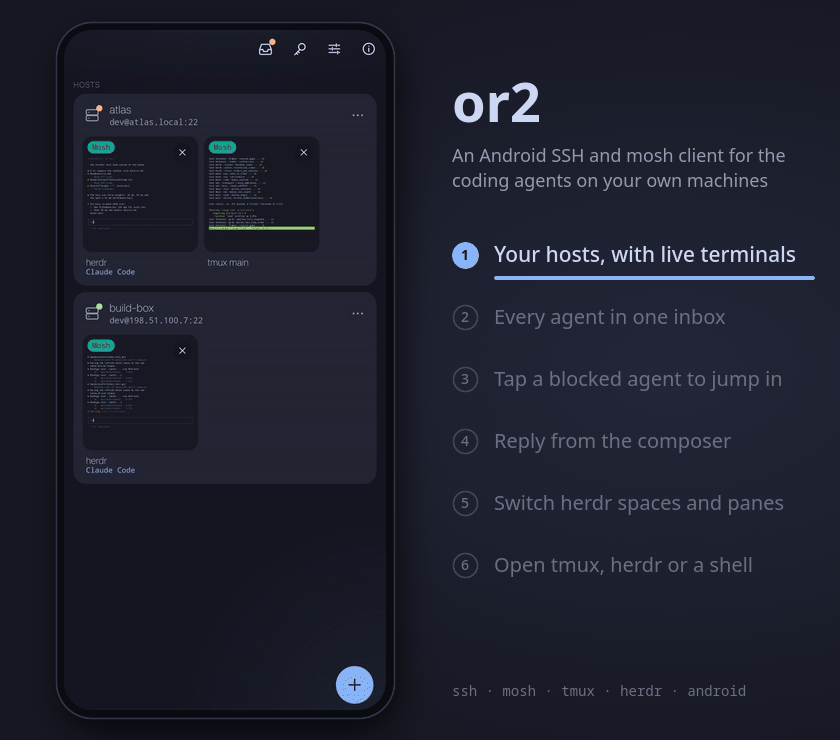

# or2

A free, open-source Android client for SSH and mosh, built for driving coding agents that run in
tmux or herdr on your own machines.

<p align="center">
  
</p>
<p align="center"><sub>The real app on a phone, driven through invented hosts and agents (<a href="docs/build.md#readme-demo">how it is made</a>).</sub></p>

Status: v0.1.6 released (terminal rendering, scrolling, RGB themes and launcher/picker polish). One SSH connection per host carries
terminals, tmux and a live herdr agent inbox across hosts; tap an agent to open its pane and answer
from the composer, or let a notification bring you there. Terminals open at once and switch to mosh in
the background; mosh roams across networks, a foreground service keeps sessions open in the background,
and the app reattaches to the last pane. What is not tested yet is listed in
[the release notes](docs/releases/v0.1.6.md#verified-and-still-untested); changes are in the
[changelog](CHANGELOG.md).
See [status and next steps](docs/status.md), [the design](docs/design.md), [contracts](docs/contracts.md)
and [build instructions](docs/build.md).

## Install

**The app:** download the APK from the [latest release](https://github.com/code-akram/or2/releases/latest)
(Android 14 or later, arm64), check its SHA-256 against the release notes, and install it. It is signed
with the or2 release key, so it cannot be installed over a development (debug) build.

**On each host:** add it to or2 by [pairing it with one command and a QR scan](docs/pairing.md)
(`or2-pair`), or [set it up manually](docs/manual-setup.md). Install `or2-pair` on a Linux or macOS
host (into `~/.local/bin`, checksum verified, no sudo), then run it:

```sh
curl -fsSL https://raw.githubusercontent.com/code-akram/or2/main/scripts/install-or2-pair.sh | sh
or2-pair
```

To read the script before it runs, download it first:
`curl -fsSLO https://raw.githubusercontent.com/code-akram/or2/main/scripts/install-or2-pair.sh`, read
`install-or2-pair.sh`, then `sh install-or2-pair.sh`. It installs the binary for your host from the
[latest release](https://github.com/code-akram/or2/releases/latest) (`--version vX.Y.Z` for another)
and checks it against the release's `SHA256SUMS`. That check proves the download is intact, not who
made it: both come from the same GitHub release (signed releases are a future item). To build it from
source instead: `cargo install --git https://github.com/code-akram/or2 or2-pair --locked` (see
[Pair a host](docs/pairing.md#1-install-or2-pair-on-the-host)).

License: GPL-3.0-or-later.

## Acknowledgements

or2 is built on other people's open-source work, and is better for every project below. Thank you.

- [Ghostty](https://github.com/ghostty-org/ghostty) and its terminal library libghostty-vt, which
  or2 reaches through [libghostty-rs](https://github.com/Uzaaft/libghostty-rs), emulate the
  terminal; [Zig](https://ziglang.org) builds it.
- [russh](https://github.com/Eugeny/russh) speaks SSH, on top of [tokio](https://tokio.rs) and
  [aws-lc-rs](https://github.com/aws/aws-lc-rs); [RustCrypto](https://github.com/RustCrypto) and
  [dalek-cryptography](https://github.com/dalek-cryptography) provide the ciphers, hashes and keys.
- [mosh](https://mosh.org) by Keith Winstein and contributors defined the protocol that keeps a
  session alive across networks, and [mosh-rs](https://github.com/wilsonglasser/mosh-rs) by
  Wilson Glasser is the Rust port or2's mosh client is derived from.
- [herdr](https://github.com/herdrdev/herdr) and [tmux](https://github.com/tmux/tmux) are what
  or2 drives on your machines; or2's herdr types are generated from herdr's own API schema.
- [UniFFI](https://github.com/mozilla/uniffi-rs) joins the Rust core to Kotlin, with
  [JNA](https://github.com/java-native-access/jna) underneath.
- [Jetpack Compose](https://developer.android.com/compose),
  [Room](https://developer.android.com/training/data-storage/room),
  [AndroidX Biometric](https://developer.android.com/jetpack/androidx/releases/biometric),
  [Kotlin](https://kotlinlang.org) and [kotlinx.coroutines](https://github.com/Kotlin/kotlinx.coroutines)
  make the app; [CameraX](https://developer.android.com/media/camera/camerax) and
  [ZXing](https://github.com/zxing/zxing) read Easy pair's QR code, and
  [qrcode](https://github.com/kennytm/qrcode-rust) draws it on the host.
- [Catppuccin](https://github.com/catppuccin/catppuccin) (Mocha) gives it its colours, and
  [Tokyo Night](https://github.com/folke/tokyonight.nvim) the terminal's.

**Moshi.** The [Moshi](https://getmoshi.app) app was the direct reference and inspiration for or2's
onboarding, the Easy pair QR flow and the compact terminal UI. Thank you to its makers for showing how
good a phone terminal for agents can be. No Moshi code is used in or2, and Moshi is a separate,
independent product with no connection to this project.

The complete list, with every licence text, is in the app (Home, About or2, Open source
licenses) and is generated by `cargo xtask gen-licenses` from the locked Cargo and Gradle
dependency graphs; code ported or vendored into the repository, and components built outside Cargo
and Gradle, are recorded in [THIRD_PARTY_NOTICES.md](THIRD_PARTY_NOTICES.md).

Every dependency was checked for compatibility with GPL-3.0-or-later: they are under MIT,
Apache-2.0, BSD, ISC, Zlib, MPL-2.0, Unicode, Unlicense, 0BSD or GPL-3.0-or-later licences, or
offer such a licence as an alternative (JNA is LGPL-2.1-or-later or Apache-2.0).
`LicenseDataTest` fails the build when a listed licence is not on that list.
